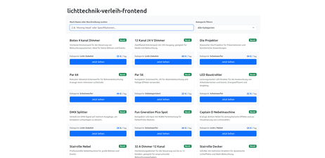
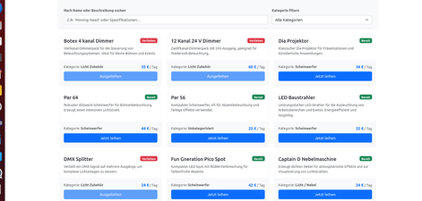
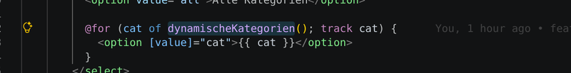
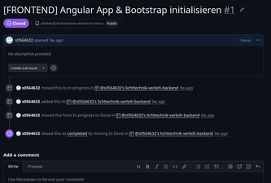

# Lichttechnik-Verleih – Frontend

***https://catlights.synoptx.net/shop?***

Das Frontend des Projekts **Leons Lichttechnik-Verleih** stellt die clientseitige Benutzeroberfläche für die Recherche, Ausleihe und Verwaltung von Lichttechnik-Equipment bereit.

Die Anwendung wurde mit **Angular 22** auf Basis der Standalone Component Architecture entwickelt. Für die Gestaltung und das responsive Layout werden **Bootstrap 5.3** und Bootstrap Icons verwendet. Die Kommunikation mit dem Backend erfolgt über den Angular `HttpClient` und eine REST-API.

## Features

* Responsive Startseite mit Hero- und Kontaktbereich
* Übersicht des verfügbaren Lichttechnik-Equipments
* Suche nach Equipment
* Filterung nach Kategorien und Unterkategorien
* Verleihfunktion mit Bestandsaktualisierung
* Administrativer Verwaltungsbereich
* Erstellen, Bearbeiten und Löschen von Equipment
* Reaktive Formulare mit Validierung
* Statusanzeige für verfügbares und verliehenes Equipment
* Zweistufiges Kategoriemenü als Flyout-Navigation
* Tastatur- und Klicksteuerung der Navigation
* URL-basierte Such- und Kategorieparameter
* Fehlerbehandlung für Lade- und Aktionsfehler

## Technologie-Stack

| Technologie        | Verwendung                    |
| ------------------ | ----------------------------- |
| Angular 22         | Frontend-Framework            |
| TypeScript         | Programmiersprache            |
| Angular Signals    | Zustandsverwaltung            |
| RxJS               | Reaktive Datenverarbeitung    |
| Bootstrap 5.3      | UI- und CSS-Framework         |
| Bootstrap Icons    | Icons                         |
| Angular Router     | Routing                       |
| Angular HttpClient | Kommunikation mit dem Backend |
| Reactive Forms     | Formulare und Validierung     |
| Jasmine / Karma    | Tests                         |
| Angular CLI        | Entwicklung und Build         |

Die Anwendung verwendet Angular Standalone Components und benötigt daher keine `NgModule`-Struktur.

## Architektur

Die Anwendung ist in eigenständige Angular-Komponenten und einen zentralen Service für die Kommunikation mit der REST-API gegliedert.

### Zentrale Komponenten

* **App**
  Einstiegspunkt der Angular-Anwendung und übergeordnete Anwendungskomponente.

* **HomeComponent**
  Startseite mit Hero-Bereich und Kontaktbereich.

* **Navbar**
  Globale Navigation mit Kategoriemenü, Suche und responsiver Menüsteuerung.

* **Shop**
  Öffentliche Equipment-Übersicht mit Suche, Kategorie-Filter und Verleihfunktion.

* **Verwaltung**
  Administrativer Bereich für die Verwaltung des Equipment-Bestands.

  |  |  |

### EquipmentService

Der `EquipmentService` kapselt sämtliche HTTP-Anfragen an das Backend.

```text
src/app/
├── core/
│   └── components/
│       └── navbar/
├── home/
├── shop/
├── verwaltung/
├── interfaces/
│   └── equipment.interface.ts
├── services/
│   └── equipment.ts
├── app.ts
├── app.config.ts
└── app.routes.ts
```

Das zentrale Datenmodell ist das Interface `Equipment`.

```typescript
interface Equipment {
  _id: string;
  name: string;
  category: string;
  subCategory: string;
  lengthValue?: number | null;
  lengthUnit?: string;
  quantity: number;
  priceDay: number;
  description: string;
  createdAt?: string;
  updatedAt?: string;
}
```

Für das Erstellen und Bearbeiten von Equipment wird zusätzlich der Typ `EquipmentInput` verwendet. Dabei werden serverseitig verwaltete Felder wie `_id`, `__v` und Zeitstempel ausgeschlossen.

## Routing

Die Anwendung verwendet den Angular Router.

| Route         | Komponente      | Funktion                        |
| ------------- | --------------- | ------------------------------- |
| `/`           | Weiterleitung   | Weiterleitung auf `/home`       |
| `/home`       | `HomeComponent` | Startseite                      |
| `/shop`       | `Shop`          | Öffentliche Equipment-Übersicht |
| `/verwaltung` | `Verwaltung`    | Equipment-Verwaltung            |

Die Anwendung verwendet außerdem URL-Query-Parameter für die Suche und Kategoriefilterung.

Beispiel:

```text
/shop?suche=LED
/shop?kategorie=LED-Scheinwerfer
```

Die Query-Parameter werden über Angular `toSignal()` in reaktive Zustände überführt.

## Shop

Die Shop-Komponente lädt den aktuellen Equipment-Bestand über den `EquipmentService` vom Backend.



Die angezeigte Liste kann anhand von Suchbegriff und Kategorie gefiltert werden. Die Filterung wird über ein `computed` Signal abgebildet.

Für die Verleihfunktion wird der entsprechende Equipment-Eintrag über den Backend-Endpunkt aktualisiert. Während einer laufenden Aktion verhindert ein `isSaving`-Signal Mehrfachauslösungen.

Für Fehler werden zwei getrennte Zustände verwendet:

* `loadError` für Fehler beim Laden des Bestands
* `actionError` für Fehler bei einzelnen Aktionen wie dem Verleih

Dadurch bleibt die bereits geladene Equipment-Liste auch dann sichtbar, wenn beispielsweise eine einzelne Aktion fehlschlägt.

## Equipment-Verwaltung

Unter `/verwaltung` steht ein administrativer Bereich für die Verwaltung des Equipment-Bestands zur Verfügung.

Unterstützt werden:

* **Create** – neues Equipment anlegen
* **Read** – vorhandenen Bestand anzeigen
* **Update** – bestehendes Equipment bearbeiten
* **Delete** – Equipment löschen

Die Formulare verwenden Angular Reactive Forms mit `FormBuilder` und `Validators`.

Die Dialoge für Erstellen, Bearbeiten und Löschen werden direkt über Angular Signals gesteuert. Dadurch wird auf eine Steuerung der Modals durch Bootstrap-JavaScript verzichtet.

## Navigation

Die Navbar enthält ein zweistufiges Kategoriemenü.

Die Kategorien sind in Hauptgruppen und Unterkategorien gegliedert. Die Navigation unterstützt:

* Maussteuerung
* Tastatursteuerung
* Schließen per Escape-Taste
* Schließen bei Klick außerhalb des Menüs
* Suche über URL-Query-Parameter

## Voraussetzungen

Für die lokale Entwicklung werden benötigt:

* Node.js 18 oder höher
* npm
* Angular CLI
* laufendes Backend
* laufende MongoDB-Instanz über das Backend

## Installation

Repository klonen:

```bash
git clone https://github.com/s0564632/lichttechnik-verleih-frontend.git
cd lichttechnik-verleih-frontend
```

Abhängigkeiten installieren:

```bash
npm install
```

## Backend starten

Das Frontend erwartet das Backend auf Port `3000`.

Das Backend ist in einem separaten Repository dokumentiert:

`lichttechnik-verleih-backend`

## Frontend starten

Die Anwendung wird im Entwicklungsmodus mit dem konfigurierten Dev-Proxy gestartet:

```bash
npm start
```

Der Startbefehl verwendet:

```text
ng serve --proxy-config proxy.conf.json
```

Anschließend ist die Anwendung erreichbar unter:

```text
http://localhost:4200
```

## Kommunikation mit dem Backend

Das Frontend verwendet relative API-Pfade:

```text
/api/equipment
```

Die Entwicklungsumgebung leitet diese Anfragen über den Angular Dev-Proxy an das lokale Backend auf Port `3000` weiter.

Die Kommunikation wird vollständig über den `EquipmentService` gekapselt.

Unterstützte Operationen:

```text
GET     /api/equipment
POST    /api/equipment
PUT     /api/equipment/:id
PATCH   /api/equipment/:id/rent
DELETE  /api/equipment/:id
```

## Tests

Für Tests werden Jasmine und Karma zusammen mit den Angular-Testwerkzeugen verwendet.

Tests können über die entsprechenden Angular-CLI-Befehle ausgeführt werden.

## Technische Besonderheiten

### Angular Signals

Für die Zustandsverwaltung werden unter anderem `signal()`, `computed()` und `toSignal()` verwendet.

Dadurch werden beispielsweise Such- und Filterzustände sowie UI-Zustände reaktiv abgebildet.

### Reactive Forms

Die Verwaltungsformulare verwenden Angular Reactive Forms und Validierungen, unter anderem für:

* Pflichtfelder
* Mindestlänge des Namens
* gültige Tagespreise
* gültige Bestandsmengen

### Eigenständige Angular-Modals

Die CRUD-Dialoge werden deklarativ über Angular gesteuert. Bootstrap-JavaScript wird für die Modals nicht benötigt.

Dies vermeidet Konflikte zwischen direkten DOM-Manipulationen durch Bootstrap und Angulars Zustands- und Change-Detection-System.

## Bekannte technische Herausforderungen

Während der Entwicklung wurden unter anderem folgende Probleme gelöst:

* Konflikte bei der Initialisierung des Angular-Workspaces in einem bereits bestehenden Git-Repository

* fehlende Jasmine-Typdefinitionen und TypeScript-Konflikte
* Umstellung auf Angulars funktionale Dependency Injection mit `inject()`
* unterschiedliche Feldbezeichnungen zwischen Backend und Frontend
* Konflikte zwischen Bootstrap-JavaScript und Angular bei Modal-Komponenten
* Trennung von Lade- und Aktionsfehlern

## Roadmap

Mögliche zukünftige Erweiterungen:

1. Authentifizierung und Zugriffsschutz für `/verwaltung`
2. JWT-basierte Benutzerverwaltung
3. strukturierte Auswahl der Unterkategorien im Verwaltungsformular
4. Warenkorb
5. Erweiterung der Mietfunktionen
6. weitere Verbesserungen der Barrierefreiheit
7. Deployment des Frontends auf eine Hosting-Plattform

## KI-Transparenz

## Transparenzverzeichnis der KI-Werkzeuge (Frontend)

Für die Konzeption, Fehlersuche, Architekturfragen und Dokumentation der Angular-Anwendung wurden die LLM-Systeme **ChatGPT** und **Gemini** eingesetzt.

| Einsatzbereich / Zweck | Beispiel-Prompts (Recherche & Debugging) | Technische Lösung / Ergebnis |
| :--- | :--- | :--- |
| **Angular-Architektur & Dev-Proxy** | • *„Wie nutzt man in Angular einen Dev-Proxy (`proxy.conf.json`) und warum sind relative API-Pfade besser als `http://localhost:3000`?“*<br>• *„Was sind die modernen Alternativen zu Konstruktor-Injection und styleUrls in Angular 22?“* | • Einbindung von `proxy.conf.json` mit Weiterleitung auf `localhost:3000` (Eintrag in `angular.json` unter `serve`).<br>• Umstellung auf relative Pfade (z. B. `/api/equipment`).<br>• Refactoring auf `inject(HttpClient)` und die singuläre Schreibweise `styleUrl` bei Standalone-Komponenten. |
| **Signals & URL-Parametrisierung** | • *„Wie lese ich Query-Parameter in Angular als Signal aus und wie leite ich daraus gefilterte Listen mit `computed()` ab?“* | • Nutzung von `toSignal(route.queryParamMap.pipe(map(...)))` zur Erfassung von Suchbegriffen und Kategorien.<br>• Reaktive Datenfilterung via `computed()`.<br>• Verlinkung im Template über `[queryParams]`. |
| **Template-Parsing & Routing** | • *„Was ist eine ICU-Nachricht in Angular-Templates und warum sind lose `{ }` im Text ein Problem?“*<br>• *„Wie funktioniert Anker-Scrolling im Angular-Router mit fragment und `withInMemoryScrolling`?“* | • Behebung von `Unexpected character "EOF"`-Fehlern durch Korrektur unvollständiger HTML-Tags und loser geschweifter Klammern.<br>• Aktivierung von `anchorScrolling: 'enabled'` in `provideRouter` und Verwendung von `routerLink` mit `fragment` anstelle nativer `href`-Attribute. |
| **Control-Flow & UI-Komponenten** | • *„Wie steuere ich mit `@if` und `@empty` im Angular-Control-Flow Lade-, Fehler- und Leerzustand sauber?“*<br>• *„Wie funktionieren Bootstrap-5-Modals mit `data-bs-toggle` und `data-bs-dismiss` in Angular?“* | • Saubere Zustandstrennung: Content wird nur bei `!isLoading() && !loadError()` gerendert.<br>• Integration von `@empty` direkt in `@for`-Schleifen.<br>• Rückbau redundanter Angular Signals zugunsten nativer Bootstrap-Datenattribute für Modals; optionaler Zugriff via `viewChild()`. |
| **Formular-Validierung** | • *„Wie definiere ich in Angular Reactive Forms Validatoren wie `required`, `minLength` und `min`?“* | • Implementierung von `FormBuilder` mit `Validators` für die Equipment-Erfassung.<br>• Bedingte Anzeige von Fehlermeldungen bei `invalid && touched`.<br>• Deklarative Deaktivierung des Absende-Buttons via `[disabled]`. |
| **Unit Testing & Test-Runner** | • *„Was bedeutet der Fehler `NG0201 No provider for ActivatedRoute` in Angular und wie stellt man im TestBed einen Router bereit?“*<br>• *„Welcher Test-Runner ist im Angular-CLI-Builder `@angular/build:unit-test` standardmäßig hinterlegt?“* | • Fehlerbehebung durch Aufnahme von `provideRouter([])` und `provideHttpClientTesting()` in die `providers` des `TestBeds`.<br>• Anpassung der `tsconfig.spec.json` und Dokumentation an den Standard-Runner Vitest. |
| **Git-Workflows & Dokumentation** | • *„Wie verwerfe ich alle uncommitteten Änderungen in `package.json` und `package-lock.json` und setze den Branch `51-angular-test-reperieren` auf den Stand von `origin` zurück?“*<br>• *„Welche Abschnitte gehören typischerweise in die README eines Node/Express-Projekts mit MongoDB?“* | • Gezieltes Zurücksetzen lokaler Konfigurationsdateien via `git restore`.<br>• Strukturierung des technischen Dokumentationsaufbaus im Markdown-Format. |
